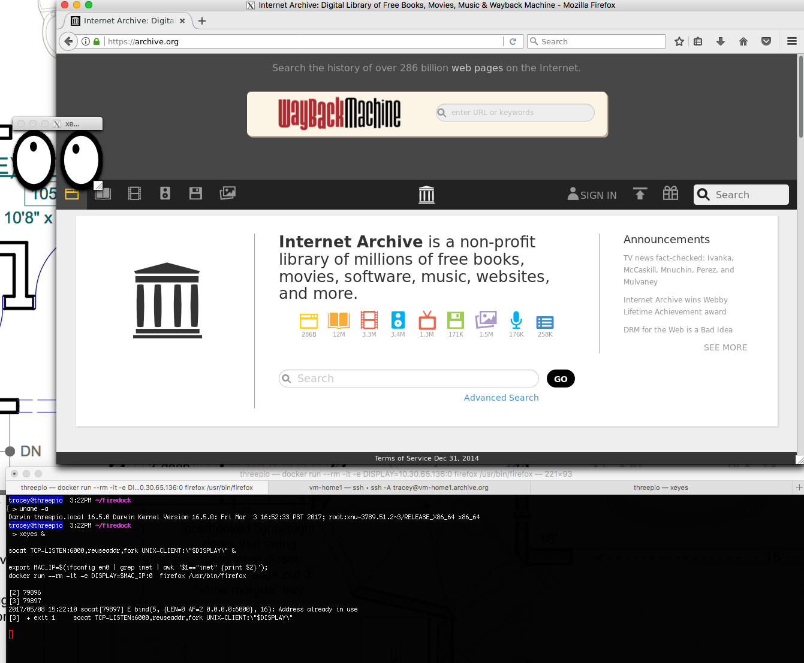

# firedock
firefox (ubuntu) via docker running on your mac using X11 for GUI

adatped from:
http://fabiorehm.com/blog/2014/09/11/running-gui-apps-with-docker/
https://hub.docker.com/r/playniuniu/docker-gui-firefox/

# install xquartz on to your mac

`docker build -t firefox .`

# fire up X (with some googlies)
`xeyes &`

`socat TCP-LISTEN:6000,reuseaddr,fork UNIX-CLIENT:\"$DISPLAY\" &`

`export MAC_IP=$(ifconfig en0 | grep inet | awk '$1=="inet" {print $2}')`

`docker run --rm -it -e DISPLAY=$MAC_IP:0  firefox /usr/bin/firefox`

